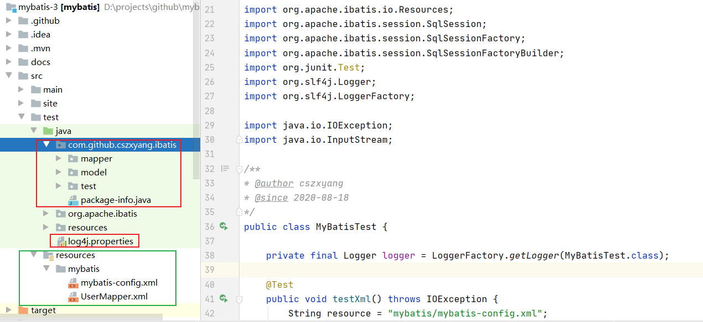
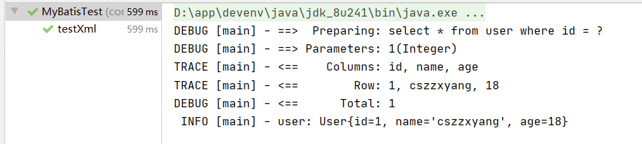
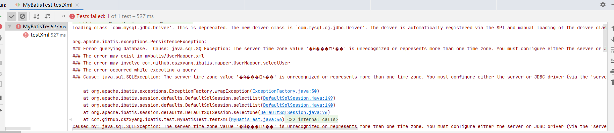

### 搭建测试环境

首先创建测试数据表并初始化数据：

```mysql
CREATE TABLE `user` (
  `id` int(11) DEFAULT NULL,
  `name` varchar(255) DEFAULT '',
  `age` int(9) DEFAULT '0'
) ENGINE=InnoDB DEFAULT CHARSET=utf8;

insert into user values (1, 'cszzxyang', 18);
```

接下来需要去 `Github`  clone 下 `Mybatis-3` 的源代码，当然你也可直接拉我这个项目的代码。



图中绿色部分表示新增的内容，红色部分为修改的内容，具体来说，为了在测试中打印更详尽的信息，我们修改 `log4j.properties`，在末尾追加下面内容，其中 `com.github.cszxyang.ibatis` 为测试包名。

```properties
log4j.logger.com.github.cszxyang.ibatis=TRACE
```

然后新增 model 实体，与数据库表对应

```java
public class User implements Serializable {
    private int id;
    private String name;
    private int age;

    public User() {}
    
    //......
}
```

新增映射接口 `UserMapper`

```java
public interface UserMapper {
    User selectUser(Integer id);
}
```

然后在资源目录下新增与 `mybatis` 相关的配置信息，定义在 `mybatis-config.xml` 中，其中暂时指定数据源和映射的配置文件。

```xml
<?xml version="1.0" encoding="UTF-8" ?>
<!DOCTYPE configuration
        PUBLIC "-//mybatis.org//DTD Config 3.0//EN"
        "http://mybatis.org/dtd/mybatis-3-config.dtd">
<configuration>
    
    <environments default="development">
        <environment id="development">
            <transactionManager type="JDBC"/>
            <dataSource type="POOLED">
                <property name="driver" value="com.mysql.jdbc.Driver"/>
                <property name="url" value="jdbc:mysql://localhost:3306/test?useSSL=false"/>
                <property name="username" value="root"/>
                <property name="password" value="123456"/>
            </dataSource>
        </environment>
    </environments>

    <mappers>
        <mapper resource="mybatis/UserMapper.xml"/>
    </mappers>

</configuration>
```

在 `UserMapper.xml` 中则定义了一个查询接口，在其中写上相应的 `SQL`。

```xml
<?xml version="1.0" encoding="UTF-8" ?>
<!DOCTYPE mapper
        PUBLIC "-//mybatis.org//DTD Mapper 3.0//EN"
        "http://mybatis.org/dtd/mybatis-3-mapper.dtd">

<mapper namespace="com.github.cszxyang.ibatis.mapper.UserMapper">
    <select id="selectUser" resultType="com.github.cszxyang.ibatis.model.User">
       select * from user where id = #{id}
  </select>
</mapper>
```

好了，现在我们在测试类中进行简单的测试：

```java
public class MyBatisTest {

    private final Logger logger = LoggerFactory.getLogger(MyBatisTest.class);

    @Test
    public void testXml() throws IOException {
        String resource = "mybatis/mybatis-config.xml";
        InputStream inputStream = Resources.getResourceAsStream(resource);
        SqlSessionFactory sqlSessionFactory = new SqlSessionFactoryBuilder().build(inputStream);
        SqlSession sqlSession = sqlSessionFactory.openSession();
        User user = sqlSession.selectOne("com.github.cszxyang.ibatis.mapper.UserMapper.selectUser",1);
        logger.info("user: {}", user);
    }
}
```

然后看到有以下的输出，说明环境已经搭建成功。



### 可能会遇到的问题

`MySQL` 驱动版本问题



更换原 `pom.xml` 中的驱动版本即可，直接 move on~

```xml
<!--<dependency>
      <groupId>mysql</groupId>
      <artifactId>mysql-connector-java</artifactId>
      <version>8.0.21</version>
      <scope>test</scope>
    </dependency>-->
<dependency>
    <groupId>mysql</groupId>
    <artifactId>mysql-connector-java</artifactId>
    <version>5.1.48</version>
</dependency>
```

