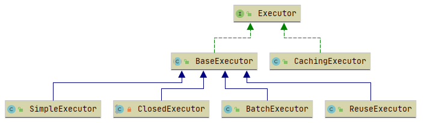

再看执行器 Executor 如何进行工作的，它是一个接口，其中定义了 update 和 query 的基本增删查改操作、事务提交与回滚等、缓存管理、批处理刷新等方法。

```java
public interface Executor {
    ResultHandler NO_RESULT_HANDLER = null;
    int update(MappedStatement ms, Object parameter) throws SQLException;
    <E> List<E> query(MappedStatement ms, Object parameter, RowBounds rowBounds, ResultHandler resultHandler, CacheKey cacheKey, BoundSql boundSql) throws SQLException;
    <E> List<E> query(MappedStatement ms, Object parameter, RowBounds rowBounds, ResultHandler resultHandler) throws SQLException;
    <E> Cursor<E> queryCursor(MappedStatement ms, Object parameter, RowBounds rowBounds) throws SQLException;
    List<BatchResult> flushStatements() throws SQLException;
    void commit(boolean required) throws SQLException;
    void rollback(boolean required) throws SQLException;
    CacheKey createCacheKey(MappedStatement ms, Object parameterObject, RowBounds rowBounds, BoundSql boundSql);
    boolean isCached(MappedStatement ms, CacheKey key);
    void clearLocalCache();
    void deferLoad(MappedStatement ms, MetaObject resultObject, String property, CacheKey key, Class<?> targetType);
    Transaction getTransaction();
    void close(boolean forceRollback);
    boolean isClosed();
    void setExecutorWrapper(Executor executor);
}
```

这里有人可能会问为什么只有 update 和 query，但其实在 PreparedStatement 接口中 也只有executeQuery 和 executeUpdate 这两个接口，增删改都由 executeUpdate 完成。

Executor 的体系类图如下所示：



### Executor 实现间的差异

我们先在单元测试中初始化一些构建执行器所需要依赖的对象

```java
public class ExecutorTest {
    private final Logger logger = LoggerFactory.getLogger(ExecutorTest.class);
    private Configuration configuration;
    private Connection connection;
    private JdbcTransaction jdbcTransaction;

    @Before
    public void init() throws SQLException {
        SqlSessionFactoryBuilder factoryBuilder = new SqlSessionFactoryBuilder();
        SqlSessionFactory sqlSessionFactory = factoryBuilder.build(ExecutorTest.class.getResourceAsStream("/mybatis/mybatis-config.xml"));
        configuration = sqlSessionFactory.getConfiguration();
        connection = DriverManager.getConnection(JDBC.url, JDBC.username, JDBC.password);
        jdbcTransaction = new JdbcTransaction(connection);
    }
}
```

然后我们开始进行测试。

#### SimpleExecutor

```java
@Test
public void testSimpleExecutor() throws SQLException {
    SimpleExecutor simpleExecutor = new SimpleExecutor(configuration, jdbcTransaction);
    MappedStatement mappedStatement = configuration.
        getMappedStatement("com.github.cszxyang.ibatis.mapper.UserMapper.selectUser");
    List<Object> objects = simpleExecutor.doQuery(mappedStatement, 1, RowBounds.DEFAULT, SimpleExecutor.NO_RESULT_HANDLER, mappedStatement.getBoundSql(1));
    System.out.println(objects.get(0));
    List<Object> objects1 = simpleExecutor.doQuery(mappedStatement, 1, RowBounds.DEFAULT, SimpleExecutor.NO_RESULT_HANDLER, mappedStatement.getBoundSql(1));
    System.out.println(objects1.get(0));
}
```

上面测试代码中，对于同一条 SQL 语句，我们执行了两次，通过执行结果我们看到，SimpleExecutor 会进行两次 SQL 预处理和查询操作。


#### ReuseExecutor

```java
@Test
public void testReuseExecutor() throws SQLException {
    ReuseExecutor simpleExecutor = new ReuseExecutor(configuration, jdbcTransaction);
    MappedStatement mappedStatement = configuration.
        getMappedStatement("com.github.cszxyang.ibatis.mapper.UserMapper.selectUser");
    List<Object> objects = simpleExecutor.doQuery(mappedStatement, 1, RowBounds.DEFAULT, SimpleExecutor.NO_RESULT_HANDLER, mappedStatement.getBoundSql(1));
    System.out.println(objects.get(0));
    List<Object> objects1 = simpleExecutor.doQuery(mappedStatement, 1, RowBounds.DEFAULT, SimpleExecutor.NO_RESULT_HANDLER, mappedStatement.getBoundSql(1));
    System.out.println(objects1.get(0));
}
```

通过日志可以看到其中只进行了一次预处理操作


#### BatchExecutor

针对增删改操作，可以使用 BatchExecutor 进行批量操作，减少对 SQL 语句的预处理编译操作。

先看数据库的数据情况


然后我们进行测试：

```java
@Test
public void testBatchExecutor() throws SQLException {
    BatchExecutor simpleExecutor = new BatchExecutor(configuration, jdbcTransaction);
    MappedStatement mappedStatement = configuration.
        getMappedStatement("com.github.cszxyang.ibatis.mapper.UserMapper.updateById");
    Map<String, Object> objectHashMap = new HashMap<>();
    objectHashMap.put("id", 1);
    objectHashMap.put("name", "new-cszxyang");
    Map<String, Object> objectHashMap1 = new HashMap<>();
    objectHashMap1.put("id", 1);
    objectHashMap1.put("name", "new-cszxyang1");
    simpleExecutor.doUpdate(mappedStatement, objectHashMap);
    simpleExecutor.doUpdate(mappedStatement, objectHashMap1);
}
```

可以看到我们虽然进行了两次更新操作，但是只进行了一次 prepare


但是再看数据库，我们发现数据库中的 id 为 1 的数据的 name 并没有改成我们想要的


原来对于批处理执行器，需要进行批处理刷新，在测试代码中加上`batchExecutor.doFlushStatements(false);`我们发现数据更新成功。


### Executor 的设计

从上面测试中可以看到不同执行器有着不同的特性，但是它们也有一些共用的方法，比如事务管理、连接管理、公用的缓存处理等等，这些都可以写到一个类中去进行复用，其他差异部分提供抽象方法让子类去实现，这明显使用了 **模板方法设计模式**。

```java
public abstract class BaseExecutor implements Executor {
    protected abstract int doUpdate(MappedStatement ms, Object parameter) throws SQLException;

    protected abstract List<BatchResult> doFlushStatements(boolean isRollback) throws SQLException;

    protected abstract <E> List<E> doQuery(MappedStatement ms, Object parameter, RowBounds rowBounds, ResultHandler resultHandler, BoundSql boundSql)
        throws SQLException;

    protected abstract <E> Cursor<E> doQueryCursor(MappedStatement ms, Object parameter, RowBounds rowBounds, BoundSql boundSql)
        throws SQLException;

    @Override
    public int update(MappedStatement ms, Object parameter) throws SQLException {
        ErrorContext.instance().resource(ms.getResource()).activity("executing an update").object(ms.getId());
        if (closed) {
            throw new ExecutorException("Executor was closed.");
        }
        clearLocalCache();
        return doUpdate(ms, parameter);
    }

    @Override
    public List<BatchResult> flushStatements() throws SQLException {
        return flushStatements(false);
    }

    public List<BatchResult> flushStatements(boolean isRollBack) throws SQLException {
        if (closed) {
            throw new ExecutorException("Executor was closed.");
        }
        return doFlushStatements(isRollBack);
    }

    @Override
    public <E> List<E> query(MappedStatement ms, Object parameter, RowBounds rowBounds, ResultHandler resultHandler) throws SQLException {
        BoundSql boundSql = ms.getBoundSql(parameter);
        CacheKey key = createCacheKey(ms, parameter, rowBounds, boundSql);
        return query(ms, parameter, rowBounds, resultHandler, key, boundSql);
    }


    @Override
    public <E> Cursor<E> queryCursor(MappedStatement ms, Object parameter, RowBounds rowBounds) throws SQLException {
        BoundSql boundSql = ms.getBoundSql(parameter);
        return doQueryCursor(ms, parameter, rowBounds, boundSql);
    }

    private <E> List<E> queryFromDatabase(MappedStatement ms, Object parameter, RowBounds rowBounds, ResultHandler resultHandler, CacheKey key, BoundSql boundSql) throws SQLException {
        List<E> list;
        localCache.putObject(key, EXECUTION_PLACEHOLDER);
        try {
            list = doQuery(ms, parameter, rowBounds, resultHandler, boundSql);
        } finally {
            localCache.removeObject(key);
        }
        localCache.putObject(key, list);
        if (ms.getStatementType() == StatementType.CALLABLE) {
            localOutputParameterCache.putObject(key, parameter);
        }
        return list;
    }
}
```

