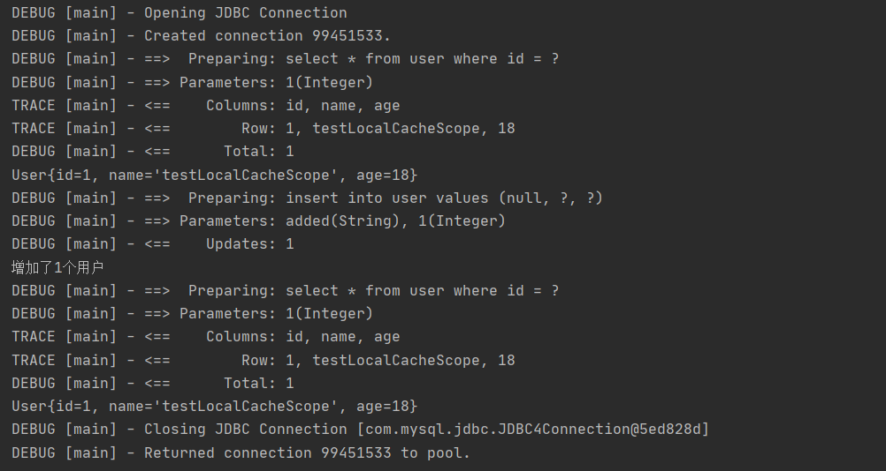
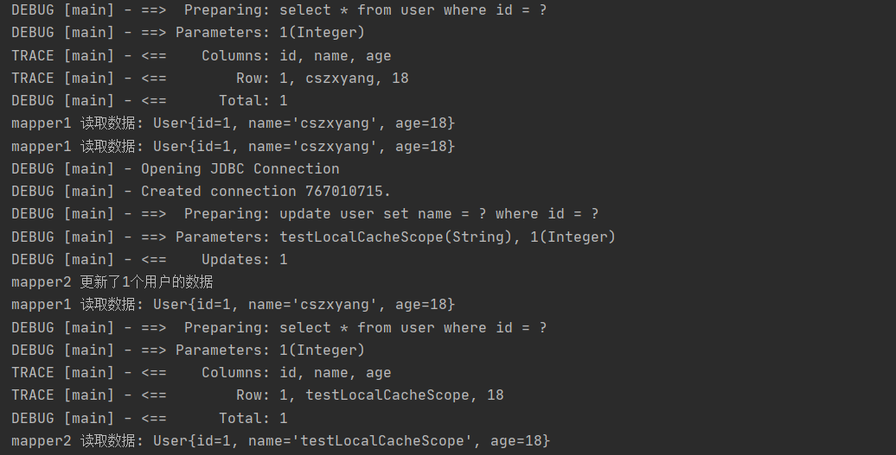
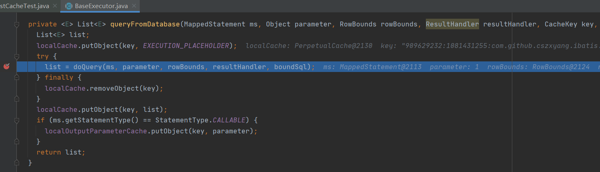
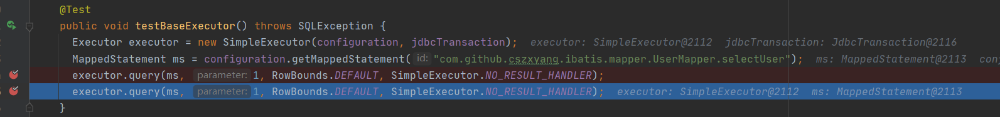
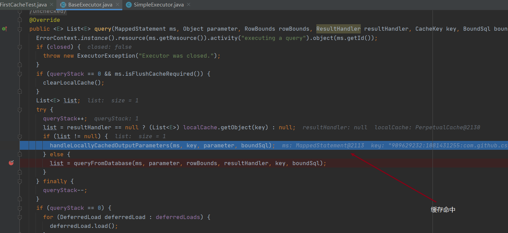

### 缓存特性

Mybatis 的一级缓存实现封装在 BaseExecutor 中


先来测试一下缓存的特性，首先我们在测试单元启动前初始化 SqlSessionFactory。

```java
public class CachingTest {

    private SqlSessionFactory sqlSessionFactory;

    @Before
    public void init() {
        SqlSessionFactoryBuilder factoryBuilder = new SqlSessionFactoryBuilder();
        sqlSessionFactory = factoryBuilder.build(CachingTest.class.getResourceAsStream("/mybatis/mybatis-config.xml"));
    }
}
```

#### 1. 连查 - 缓存生效

然后我们获取 sqlSession，此时的缓存范围为会话级别。

```java
@Test
public void selectUser() throws Exception {
    SqlSession sqlSession = sqlSessionFactory.openSession(true); // 自动提交事务
    UserMapper mapper = sqlSession.getMapper(UserMapper.class);
    System.out.println(mapper.selectUser(1));
    System.out.println(mapper.selectUser(1));
}
```

通过控制台输出结果我们可知上面的两次查询中只查询了一次数据库，后续的查询使用了缓存。



#### 2. 缓存失效: 查 - 写 - 查

```java
@Test
public void addUser() throws Exception {
    SqlSession sqlSession = sqlSessionFactory.openSession(true); // 自动提交事务
    UserMapper mapper = sqlSession.getMapper(UserMapper.class);
    System.out.println(mapper.selectUser(1));
    System.out.println("增加了" + mapper.addUser("added", 1) + "个用户");
    System.out.println(mapper.selectUser(1));
    sqlSession.close();
}
```

通过控制台输出结果我们可知上面，在修改操作后执行的相同查询，查询了数据库，**缓存失效**。


#### 3. 多 session 间缓存共享问题

开启两个`SqlSession`，在 `sqlSession1` 中查询数据，使缓存生效，在 `sqlSession2` 中更新数据库，验证缓存只在数据库会话内部共享。

```java
@Test
public void testLocalCacheScope() throws Exception {
    SqlSession sqlSession1 = sqlSessionFactory.openSession(true); // 自动提交事务
    UserMapper mapper1 = sqlSession1.getMapper(UserMapper.class);

    SqlSession sqlSession2 = sqlSessionFactory.openSession(true); // 自动提交事务
    UserMapper mapper2 = sqlSession2.getMapper(UserMapper.class);

    System.out.println("mapper1 读取数据: " + mapper1.selectUser(1));
    System.out.println("mapper1 读取数据: " + mapper1.selectUser(1));
    System.out.println("mapper2 更新了" + mapper2.updateByIdXml(1, "testLocalCacheScope") + "个用户的数据");
    System.out.println("mapper1 读取数据: " + mapper1.selectUser(1));
    System.out.println("mapper2 读取数据: " + mapper2.selectUser(1));
}
```

通过日志我们看到 sqlSession2 更新了 id 为 1 那行记录，但是在此之后 sqlSession1 读到了脏数据。之所以这样是，sqlSession2 没法操作 sqlSession1 的缓存。



### 一级缓存源码

如果你 debug 上面的代码会发现其中使用二级缓存，而为了了解一级缓存的逻辑，我们需要聚焦 BbaseExecutor。首先我们初始化一下需要用到的环境。

```java
public class FirstCacheTest {

    private Configuration configuration;
    private Connection connection;
    private JdbcTransaction jdbcTransaction;

    @Before
    public void init() throws SQLException {
        SqlSessionFactoryBuilder factoryBuilder = new SqlSessionFactoryBuilder();
        SqlSessionFactory sqlSessionFactory = factoryBuilder.build(ExecutorTest.class.getResourceAsStream("/mybatis/mybatis-config.xml"));
        configuration = sqlSessionFactory.getConfiguration();
        connection = DriverManager.getConnection(JDBC.url, JDBC.username, JDBC.password);
        jdbcTransaction = new JdbcTransaction(connection);
    }
}
```

然后我们创建 SimpleExecutor，在上上一节中，我们直接创建的是 SimpleExecutor 对象，并调用 doQuery 方法，但是在这里我们调用的是它的接口 Executor 中的 query 方法，而在上一节中我们知道这会调用到 BaseExecutor 中的模板 query 方法，然后再在其中调用钩子函数 doQuery 。

```java
@Test
public void testBaseExecutor() throws SQLException {
    Executor executor = new SimpleExecutor(configuration, jdbcTransaction);
    MappedStatement ms = configuration.getMappedStatement("com.github.cszxyang.ibatis.mapper.UserMapper.selectUser");
    executor.query(ms, 1, RowBounds.DEFAULT, SimpleExecutor.NO_RESULT_HANDLER);
    executor.query(ms, 1, RowBounds.DEFAULT, SimpleExecutor.NO_RESULT_HANDLER);
}
```

通过结果我们看到，即便使用 SimpleExecutor 和执行两次 query 查询，但是还是只查询了一次数据库。


下面我们进行 debug 调试

#### 第一次查询：走数据库


我们进入 query 方法


因为我们是第一次查询，缓存中没有数据，所以会进入 queryFromDatabase 方法，其中调用具体的 BaseExecutor  实现（此处 SimpleExecutor）进行查询数据库操作。可见查询到数据后再将数据塞进缓存中去。



现在我们再跳进 doQuery 方法。然后进入了 SimpleExecutor 的 doQuery 方法。


#### 第二次查询：走一级缓存

下面我们再回到单元测试中的第二次查询位置。



然后再次进到 BaseExecutor 的 query 方法，不过这次通过 CacheKey 命中了缓存，所以进入到 handleLocallyCachedOutputParameters 方法而不是 queryFromDatabase 查询数据库。

