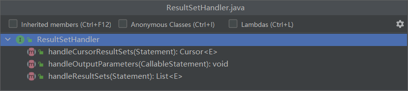

在仓库作业系统中存在很多地方需要将表列默认值设置为一个遥远的过去时间，比如对于某个在流水线上运动的箱子而言，它会经过扫箱占用、中间处理、关箱等一系列操作，因为需要用时刻标识了箱子有效生命周期的重要节点，但是这些节点发生的时刻是无法预知的，设置成当前时间或未来时间都是不合理的，而设置成当前时间的前一天也是不合理，通常的做法是设置成 `1970-01-01 00:00:00`，用来代表该列数据没有被更新过，这样又面临一个问题，`1970-01-01 00:00:00` 是程序员能理解的默认值，如果展示到前端，会使得用户困惑，因为它是一个有效而错误的时间，所以需要在返回数据前进行拦截处理。

可能有人会问，为什么不直接写入 null，而是筛选默认时间为 `1970-01-01 00:00:00` 后又将它置为 null，这岂不是多此一举？
这就涉及到另一个问题，在数据库表中插入 null 值会有什么影响？为此我特地写了另外一篇小文章，在此就不展开分析了。

- 从编码规范来看，null socks，它能代表任何东西，不能很好表示数据的含义。
- 对于索引列而言，null 需要多余的额外空间，同时维护索引的成本也比 not null 列大。

### `MyBatis` 拦截器介绍

`MyBatis` 拦截器只能拦截 `Executor`、`ParameterHandler`、`StatementHandler`、`ResultSetHandler` 四个对象里面的方法。

`Executor`：执行器，可拦截的操作包括基本的增删查改、缓存管理、事务管理等。


`ParameterHandler`：用于设置预编译 `SQL `的参数，所以需要对参数进行额外处理时，可通过拦截`ParameterHandler` 的 `setParameters` 方法来实现。


`StatementHandler`；负责操作 Statement 对象与数据库进行交互，在工作时还会使用 `ParameterHandler` 和 `ResultSetHandler` 对参数进行映射，对结果进行实体类的绑定，一般拦截其 prepare 方法，用于自定义一个具体的 Statement  实现。


`ResultSetHandler` ：用于对查询到的结果做处理。



### 实战

下面我们先创建和初始化数据表 container。


```mysql
CREATE TABLE `container` (
  `id` int(11) primary key auto_increment,
  `code` varchar(255) not null DEFAULT '',
  `occupied_time` datetime DEFAULT '1970-01-01 00:00:00',
  `close_time` datetime DEFAULT '1970-01-01 00:00:00'
) ENGINE=InnoDB DEFAULT CHARSET=utf8;

insert into container (code) values ('hk010120200906');
insert into container (code) values ('hk010120200907');
insert into container (code) values ('hk010120200908');
insert into container (code) values ('hk010120200909');
```

看到数据如下所示


先理一下头绪，既然我们只能拦截 4 个接口，而从需求上来看，我们其实需要拦截的是查询到的结果集，对结果集进行遍历，获取其中对象的时间类型的属性，并判断属性值是否为默认的时间。

```java
@Intercepts(@Signature(method = "handleResultSets",
                       type = ResultSetHandler.class, args = {Statement.class}))
public class DefaultTimeInterceptor implements Interceptor {

    private static final Date DEFAULT_TIME = DateUtil.parse("1970-01-01 00:00:00");
    private final Logger logger = LoggerFactory.getLogger(DefaultTimeInterceptor.class);

    @Override
    public Object intercept(Invocation invocation) throws Throwable {
        // bla bla...
        return null;
    }

    @Override
    public Object plugin(Object target) {
        return Plugin.wrap(target, this);
    }

    @Override
    public void setProperties(Properties properties) { }
}
```

关于 `plugin` 和 `setProperties` 方法，我们先机械地这样写，等以后学习其中的源码探讨原理时再回看，主要的拦截逻辑在 `intercept` 方法中。现在先把目光放在类签名上，我们看到有两个注解 `@Intercepts` 和 `@Signature`， 它们是用来标识这个拦截器所拦截的方法的，猜都能猜到，这里拦截了 `ResultSetHandler` 中的 `<E> List<E> handleResultSets(Statement stmt) throws SQLException;` 方法。具体的拦截方法如下：

```java
@Override
@SuppressWarnings("unchecked")
public Object intercept(Invocation invocation) throws Throwable {
    Object proceed = invocation.proceed();
    if (Objects.nonNull(proceed)) {
        if (proceed instanceof List) {
            logger.info("DefaultTimeInterceptor.intercept 获取到结果集，准备进入拦截逻辑");
            return handleDefaultTime((List<Object>) proceed);
        }
    }
    return proceed;
}
```

我们先判断拿到的操作结果是不是 `List` 类型的，实际上看看 `Executor` 中的定义，如果是查询，查到的都是一个集合而不是单个对象。

```java
<E> List<E> query(MappedStatement ms, Object parameter, RowBounds rowBounds, ResultHandler resultHandler, CacheKey cacheKey, BoundSql boundSql) throws SQLException;
<E> List<E> query(MappedStatement ms, Object parameter, RowBounds rowBounds, ResultHandler resultHandler) throws SQLException;
```

所以如果操作结果是 `List` 类型的，那么可以认为拦截到了查询操作，然后可对结果集进行处理。先遍历结果集，对每个如果对象不为空，则进行后续的处理。

```java
private List<Object> handleDefaultTime(List<Object> proceedList) {
    if (CollectionUtils.isNotEmpty(proceedList)) {
        List<Object> resList = new ArrayList<>();
        proceedList.forEach(proceed -> {
            if (Objects.nonNull(proceed)) {
                try {
                    resList.add(processData(proceed));
                } catch (IllegalAccessException e) {
                    e.printStackTrace();
                }
            } else {
                resList.add(null);
            }
        });
        return resList;
    }
    return proceedList;
}
```

系统中的对象可能是与数据库持久化的实体对象对应的，也可能是某个自定义的结果集，此处我们只关心实体对象，所以可以通过正则匹配对象的 Class 信息中的储存路径来判断是否是实体对象（此处略），是的话再进行后续的实体对象处理。

```java

private Object processData(Object proceed) throws IllegalAccessException {
    if (isDomain(proceed)) {
        return processDomain(proceed);
    }
    return proceed;
}

private boolean isDomain(Object data) {
    return true;
}
```

对于实体对象，我们使用 `hutool` 的 `ReflectUtil` 来遍历其所有的属性，如果某个属性的类型是时间类型，则再进一步判断属性的值是否为默认的时间值，如果是则将之值为 null。

```java
private Object processDomain(Object domainObj) throws IllegalAccessException {
    logger.info("DefaultTimeInterceptor.processDomain entered...");
    Field[] fields = ReflectUtil.getFields(domainObj.getClass());
    for (Field field : fields) {
        if (Date.class.equals(field.getType())) {
            field.setAccessible(true);
            Date date = (Date)field.get(domainObj);
            if (isDefaultDate(date)) {
                logger.info("DefaultTimeInterceptor.processDomain transforming data...");
                field.set(domainObj, null);
            }
        }
    }
    return domainObj;
}

private boolean isDefaultDate(Date date) {
    if (Objects.nonNull(date)) {
        return DEFAULT_TIME.equals(date);
    }
    return false;
}
```

